# Cardloop

**The kanban board is your agent's working memory — and the cards move themselves.**

Cardloop is a self-hosted ops center for Claude agents. Describe a task in chat or drop a card
on the board; the agent diagnoses, edits code, commits, deploys, and moves the card to **Review** —
and you watch it happen from your phone. One engine, three ways in: a web cockpit (PWA), Telegram,
and the kanban board itself. **Runs on your Claude subscription — no API key, no per-token billing.**

<!--
  ▶ DEMO GIF GOES HERE (highest-leverage asset).
  Record ~20s: drop a card → it moves to In Progress → agent works → diff appears → card lands in Review → phone ping.
  Then replace this comment with:  
-->

[](https://github.com/cardloop/cardloop/actions/workflows/ci.yml)
[](./LICENSE)


> _"Claude" is a trademark of Anthropic, PBC. Cardloop is an independent project — not affiliated
> with, endorsed by, or sponsored by Anthropic. It wraps the official `claude` CLI, which you
> install separately. See [Legal & Terms](#legal--terms)._

---

## Why this exists

Every agent tool is a chat box. You ask, it works, the conversation scrolls away — and a week
later you can't tell what shipped, what's half-done, and what you asked for twice. The agent has
no memory of the *project*, only of the *conversation*.

Cardloop was built for one person running many projects from a phone. The fix was to stop treating
the board as a UI and start treating it as **the agent's memory**: an on-disk `TASKS.md` that every
turn reads and writes. Work doesn't live in a chat log that disappears — it lives on a board that
the agent keeps honest. Mention a task and it becomes a card. Finish one and it moves itself to
Review. Nothing rots in the backlog half-done.

---

## How it works

```mermaid
flowchart LR
    C[Cockpit PWA]
    T[Telegram]
    K[Kanban card]
    C --> E
    T --> E
    K --> E
    E[run_engine&#40;&#41;<br/>async generator] --> SDK[Claude Agent SDK<br/>subscription auth]
    SDK --> O[files / git / deploy]
    E -. reconciles .-> B[(TASKS.md<br/>board)]
    K --- B
```



One transport-agnostic `run_engine()` generator feeds every channel. Whatever you do — type in the
cockpit, message the bot, or move a card — runs through the same engine, against the same session,
and updates the same board.

---

## The board is the source of truth

Cardloop makes the **kanban board** the shared working memory between you and the agents:

- **Board-aware agents.** Every turn — cockpit, Telegram, or card — the agent sees the live board.
  New work belongs on the board, not in a disappearing chat log.
- **Self-maintaining.** After each turn the system reconciles the board against what actually
  happened (commits, diffs, the agent's own summary): new work gets a card, finished work moves to
  Review. The backlog stops filling with tasks that were quietly completed days ago.
- **Visible.** Open a project and watch work move across columns in real time — queued, running,
  waiting on you.

### What the board looks like

`TASKS.md` in each repo *is* the board — sections are columns, lines are cards:

```markdown
## Backlog
- [a1b2c3] Add rate-limit headers to the login endpoint
- [d4e5f6] Write the onboarding email copy

## In Progress
- [99aa88] Fix mobile chat scroll jumping on keyboard open

## Review
- [77bb66] Bump vite to v8 + verify build  ← agent finished; diff waiting for you

## Done
- [55cc44] Add requirements.txt
```

The lifecycle: **you add a card → drag it to In Progress → the engine runs the task → result + git
diff are attached → the card lands in Review (or Failed) → you get a ping.** Move a card, and the
agent picks it up. See [`specs/spec-034-board-centric-os.md`](specs/spec-034-board-centric-os.md)
for the design.

---

## How this is different

The "personal AI ops center" niche is wide open. Most neighbours are either a chat UI bolted onto
an agent, or multi-provider orchestration frameworks. Cardloop's bets are narrower and opinionated:

- **Kanban-as-working-memory.** `TASKS.md` is on-disk truth and the agent moves its own cards.
  Most tools lose the thread the moment the chat ends; here the board *is* the thread.
- **Three channels, one session.** Telegram + PWA + autorun cards share a single engine and
  session — start on your phone, finish in the browser.
- **Subscription-first.** No API key, no per-token meter (see below).
- **Mobile-first PWA done right.** SSE reconnect on wake, safe-area, pinch-zoom, install to home
  screen. It's meant to be run from a phone.
- **Production-grade internals.** 1400+ tests, transport-agnostic engine, encrypted secret vault,
  C2 destructive-command gate, double path-traversal defence.

Trade-offs, stated plainly: it's **Claude-only** (competitors are multi-provider), and `webapp.py`
is a large monolith we're decomposing in the open. PRs welcome.

---

## Runs on your Claude subscription (no API key)

This is a feature, not a footnote. The engine reads `~/.claude/.credentials.json` (the OAuth token
issued by `claude login`) and drives the official `claude` CLI — so a Cardloop instance costs
**nothing per token** on top of your existing Claude Max/Pro subscription.

`bot.py` deliberately removes `ANTHROPIC_API_KEY` from the environment at startup to force
subscription auth; if it's set, the SDK silently switches to pay-per-token API billing. For
multi-user or commercial deployments you **should** use an API key instead — see
[Legal & Terms](#legal--terms) for the Anthropic ToS nuance.

---

## Three channels

### Cockpit (`YOUR_DOMAIN`)

A browser IDE — React + Vite SPA with an aiohttp backend.

**Sidebar:** projects with drag-and-drop sorting, collapse, unread badges. **Project tabs** at the
top — switch between projects without losing state.

**Tabs per project (left panel ~55%):**

| Tab | What it does |
|---|---|
| **Overview** | Git status, health card (6 checks), "↑ Sync" button (commit+push), run tests |
| **CLAUDE.md** | View + inline editing (double-click) |
| **Logs** | Configurable log command (`log_cmd` in topics.json) |
| **Board** | Kanban from `TASKS.md` — Backlog / In Progress / Review / Failed |
| **Files** | Project file tree + viewer (MD render, code mono) |
| **Memory** | Agent memory files |

**Chat (right panel ~45%, persistent):** SSE stream, CLI-style tool rendering (Bash/Edit/Read/Write
with diff), shared sessions (start in Telegram, continue in the browser), on-the-fly model switch,
message queue, prompt library, real interrupt (`client.interrupt`).

**Also:** free-form chats, global `$HOME` file browser, attachments (📎 / drag-drop / Ctrl+V),
subscription usage badge (5h + week), project creation/audit/health-check/rename.

### Telegram channel *(optional)*

Forum group, `@YOUR_BOT`. **Each topic = a project** (`thread_id → cwd`).

- Write a task → the agent works in that project's directory.
- Forward an alert or screenshot → the agent diagnoses and fixes it.
- Files up to 20 MB. Commands: `/reset` `/resume` `/model` `/project` `/newtopic` `/diff` `/cost`
  `/usage` `/stop` `/whoami`.

### Kanban auto-run

Moving a card to In Progress → `_run_card` triggers `run_engine` → result written to
`data/runs/<card>.md` → card moves to Review/Failed → notification.

---

## Quickstart

Minimum setup is Claude subscription auth + a web password. Telegram is optional.

```bash
# 1. Clone
git clone https://github.com/cardloop/cardloop.git && cd cardloop

# 2. Python (>= 3.11)
python3 -m venv venv
venv/bin/pip install -r requirements.txt -r requirements-dev.txt

# 3. Config
cp .env.example .env
# Required: WEB_PASSWORD, WEB_COOKIE_SALT
# Optional: BOT_TOKEN + GROUP_CHAT_ID + ALLOWED_USERS  (Telegram channel)
# Behind a proxy: set TRUSTED_PROXIES + WEB_COOKIE_SECURE=true  (see Security model)

# 4. Claude auth (subscription) — run once
claude login   # stores ~/.claude/.credentials.json

# 5. Frontend
cd web && npm install && npm run build && cd ..

# 6. Run
venv/bin/python bot.py   # Cockpit → http://localhost:8787
```

**Web only:** set `WEB_PASSWORD` + `WEB_COOKIE_SALT`, leave `BOT_TOKEN` empty — starts without Telegram.
**Public access:** put it behind a reverse proxy (Cloudflare Tunnel, nginx, Caddy) pointing at
`localhost:8787`, and read the Security model below first. By default it listens on localhost only.

Details (tests, lint, deploy, systemd) → [CONTRIBUTING.md](CONTRIBUTING.md).

---

## Security model

Cardloop is a **single-operator tool that runs agents with full host access**. Read this before
exposing it to a network.

- **Agents run with `bypassPermissions` — full host access by design.** They edit files, run git,
  and deploy without per-action prompts. Run Cardloop only on a host you're comfortable handing to
  an autonomous agent. A C2-style gate guards the most destructive commands, but the model is
  "trusted operator," not "sandboxed."
- **Single-user, not multi-tenant.** Cockpit auth is a web password + optional TOTP 2FA; Telegram
  is gated by an `ALLOWED_USERS` whitelist. There is no per-user isolation.
- **An authenticated session can read the decrypted secret vault.** By design — the vault's
  confidentiality reduces to your login (password + TOTP) and the session cookie.
- **`log_cmd` is allowlisted.** Diagnostic commands are restricted to a safe set
  (journalctl/docker/tail/…) with shell metacharacters rejected — no arbitrary command execution
  through settings.
- **The global file browser excludes** `~/.ssh`, `~/.gnupg`, `~/.claude`, `~/.config/claude-ops`,
  and `.env*`.
- **Put it behind HTTPS.** Set `WEB_COOKIE_SECURE=true` whenever you're not on `localhost`. Behind
  a reverse proxy, set `TRUSTED_PROXIES` (CSV of proxy IPs/CIDRs) so the login rate-limiter sees
  real client IPs instead of the proxy's.
- **Rate-limit state is in-memory** and resets on restart.

Found a vulnerability? Please open a private security advisory rather than a public issue.

---

## Documentation

| File | Purpose |
|---|---|
| [ARCHITECTURE.md](ARCHITECTURE.md) | Code map: where to find what, flow diagram |
| [CLAUDE.md](CLAUDE.md) | Working rules and gotchas for agents |
| [docs/API.md](docs/API.md) | HTTP API reference |
| [CONTRIBUTING.md](CONTRIBUTING.md) | Setup, tests, lint, commit style |
| `TASKS.md` | Live board (kanban) — backlog and current tasks |

---

## Tech stack

Python 3.11 · aiohttp · python-telegram-bot · Claude Agent SDK · React 18 · Vite · TypeScript ·
systemd · pytest

---

## Legal & Terms

**Trademark.** "Claude" and "Anthropic" are trademarks of Anthropic, PBC. Cardloop is an
independent open-source project and is not affiliated with, endorsed by, or sponsored by
Anthropic. Cardloop invokes the official `claude` CLI; it does not reimplement, bundle, or
modify Anthropic's software.

**Anthropic Terms of Service.** Cardloop runs the official `claude` CLI and never touches the
API or OAuth tokens directly.

- **Personal use** on your own Claude subscription is what the project targets. You are
  responsible for complying with your own Anthropic subscription terms.
- **Multi-user or commercial / hosted** deployments must use an Anthropic **API key**
  (`ANTHROPIC_API_KEY`), not a subscription. Authenticating *other* users against *their* Claude
  subscriptions through a hosted service is not permitted by Anthropic's Consumer Terms.
- By default `bot.py` removes `ANTHROPIC_API_KEY` from the environment to force subscription
  (CLI) auth. To run in API-key mode, set it in your environment before launch.

This project is provided "as is" under the [MIT License](./LICENSE); see also the
[NOTICE](./NOTICE) file for third-party attributions.

---

## Credits

The built-in default prompt templates (`spec-writer`, `debug-triage`, `pre-deploy-gate`) and the
executor sub-agent addendums (planning mode, source-driven development, doubt-check) are adapted
from [addyosmani/agent-skills](https://github.com/addyosmani/agent-skills), published under the
[MIT License](https://github.com/addyosmani/agent-skills/blob/main/LICENSE) by Addy Osmani et al.
