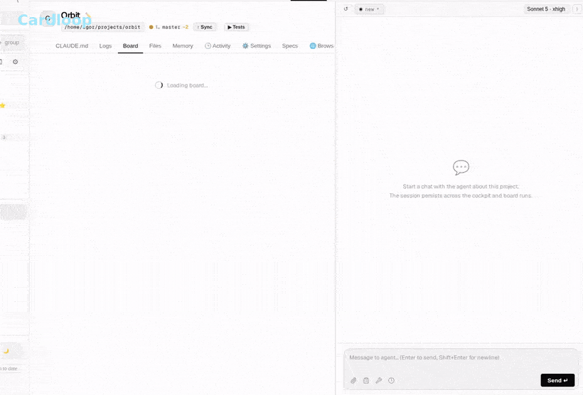

# Cardloop

### Run Claude agents on a kanban board — and watch them work from your phone.

Cardloop is a **self-hosted, mobile-first cockpit** where every kanban card *is* a Claude agent run.
Drop a card, and your home server ships the code, docs, or ops task autonomously — billed to your
existing **Claude subscription**, not per-token API calls. Install it to your phone's home screen as
a PWA and steer your projects from the couch.

<!-- HERO GIF: docs/demo.gif -->
<!--
  ▶ Record ~12s (700px, 15fps, ~3-4MB): board with cards → type a task → card auto-runs →
    streaming agent output → cut to phone (PWA) showing the same run live → card lands in Review.
  Host via GitHub CDN (drag into an issue comment, copy the user-images URL) or commit to docs/.
  Then replace this comment with:  
-->

<div align="center">

[](https://github.com/igdigitallab/cardloop/actions/workflows/ci.yml)
[](./LICENSE)


</div>

> ⭐ If this saves you time, a GitHub star helps other people find it.

---

## What it is, in 5 seconds

- **What:** a kanban board where each card auto-runs a Claude coding/ops agent to completion — full-auto.
- **Who:** one operator running many projects (software, content, ops) who isn't always at a desk.
- **Why:** the board *is* the agent's memory. Work lives on a board the agent keeps honest, not in a
  chat log that scrolls away. You write the ticket; Claude does the work; you watch it happen — on your phone.

Three things make Cardloop different from the dozen other agent kanbans:

1. 📱 **Pocket DevOps — mobile-first PWA.** Not "responsive" — *installable*. Add it to your home screen
   and run agents from your phone: live SSE streaming, reconnect on wake, safe-area, pinch-zoom, plus an
   interactive PTY terminal. The phone is the primary surface, not an afterthought.
2. 🤖 **Claude-first, subscription auth.** Runs on your existing Claude Max/Pro subscription via
   `claude login` — **no API key, no per-token bill.** Zero marginal cost per card. (API-key mode is
   there too, for teams.)
3. 🗂️ **Cards that code — safely.** A card's task text *becomes* the agent prompt. Moving a card to In
   Progress runs the engine in an isolated **git worktree**, attaches the diff, and lands the card in
   Review behind a **Check / Apply / Discard** gate — your working copy is never touched until you merge.

<!-- SCREENSHOT: docs/cockpit.png — the kanban board + live chat panel on desktop -->
<!-- SCREENSHOT: docs/mobile.png — the PWA installed on a phone home screen + a card running live -->

---

## Features

- **Kanban-as-a-runtime** — `TASKS.md` in each repo *is* the board. Sections are columns, lines are cards.
  The agent reads and writes it every turn and reconciles it against real commits/diffs after each run,
  so the board stays the single source of truth instead of a chat log that scrolls away.
- **Full-auto card runs** — drag a card to In Progress; the engine runs the task, attaches result + git
  diff, and moves it to Review or Failed, then pings you.
- **Isolated worktree runs + review gate** — on a clean git repo, each card runs in its own
  `.worktrees/card-<id>` branch (falls back to in-place "legacy" mode when git is off). The C2 gate gives
  you **🧪 Check** (run the test suite in the worktree → `safe` / `risky` verdict), **✓ Apply**
  (`git merge --no-ff`), and **✗ Discard** (trash the branch + worktree, restore clean state).
- **Deferred runs — auto-resume on rate limit** — hitting Claude's 5-hour limit doesn't abort the agent.
  Cardloop suspends the run, polls the usage quota, and resumes automatically when the limit resets.
- **Mobile-first installable PWA** — home-screen install, offline-aware SSE reconnect, touch-optimized,
  achromatic dark UI, plus a bidirectional WebSocket PTY terminal (`@xterm/xterm`) with OSC 52 clipboard
  so you can copy an OAuth login link on mobile.
- **Run-finished notifications** — a browser notification when a run completes, with click-to-jump to the
  project. In-app when the tab is open, **Web Push when the app is fully closed** (messenger-style), with
  smart de-dup so you never get both. Opt-in. See [docs/notifications.md](docs/notifications.md).
- **One subscription, no API key** — the engine drives the official `claude` CLI against your OAuth token.
- **Multi-project cockpit** — explicit projects, each with its own cwd, model, persistent session, and board.
- **One transport-agnostic engine** — `run_engine()` feeds every channel against the same session and board.
- **CLI-style chat** — SSE stream, tool rendering (Bash / Edit / Read / Write with diffs), on-the-fly model
  switch, message queue, prompt library, real interrupt.
- **Production-grade internals** — 1400+ tests, per-project secrets vault (`.claude-ops/secrets/secrets.env`,
  chmod 600), C2 destructive-command gate, double path-traversal defence, single-operator auth (web
  password + optional TOTP 2FA).
- **Always-on self-hosted service** — systemd or Docker, accessible over HTTPS / Cloudflare Tunnel.

---

## Quickstart

> **Setup time: ~3 minutes** — clone, run `install.sh`, `claude login`, set a password.

**Prerequisites**

- **Python 3.11+** and **Node 20+**
- **[Claude Code CLI](https://docs.claude.com/en/docs/claude-code/overview)** — `curl -fsSL https://claude.ai/install.sh | bash` (or `npm i -g @anthropic-ai/claude-code`). It installs to `~/.local/bin`; make sure that's on your `PATH`. The engine drives this `claude` binary, so it's needed for both `claude login` and runtime.

```bash
# 1. Clone
git clone https://github.com/igdigitallab/cardloop.git && cd cardloop

# 2. Install (venv + deps + .env scaffold + frontend build) — idempotent
./install.sh                  # or: make install

# 3. Authenticate your Claude subscription — run once
claude login                  # stores ~/.claude/.credentials.json

# 4. Set your password
#    edit .env → WEB_PASSWORD=...   (.env is a hidden dotfile; WEB_COOKIE_SALT was auto-generated for you)

# 5. Run
venv/bin/python bot.py        # Cockpit → http://localhost:8787
#    or install as a background service:  make service
```

**Prefer Docker?** `claude login` on the host, set `WEB_PASSWORD` + `WEB_COOKIE_SALT` in `.env`, then:

```bash
docker compose up --build     # cockpit-only — see docker-compose.yml
```

**On macOS:** get the prerequisites with `brew install python node` (plus the Claude CLI above); `install.sh` and the cockpit run the same as on Linux. Two platform notes: `make service` is **Linux/systemd-only**, so run `venv/bin/python bot.py` (or wrap it in a `launchd` plist / `tmux`); and `.env` is a hidden dotfile — reveal it in Finder with `⌘⇧.` or edit it from the terminal.

### Access from anywhere (your own domain)

By default Cardloop listens on **localhost only** — perfect on your own machine, but to use it from your
phone or away from home you need to reach it over the network. Two common ways (read the
[Security model](#security-model) first — you're exposing a full-auto agent, so keep `WEB_PASSWORD`
strong and enable TOTP):

- **Private, no public URL — [Tailscale](https://tailscale.com)** (simplest). Install it on the host and
  on your phone/laptop; reach the cockpit at `http://<tailscale-ip>:8787`. Nothing is exposed to the
  public internet. Great when it's just for you.

- **Public HTTPS on your own domain — [Cloudflare Tunnel](https://developers.cloudflare.com/cloudflare-one/connections/connect-networks/)**
  (works behind CGNAT/NAT, no port-forwarding, free). Point a subdomain at the cockpit:

  ```bash
  cloudflared tunnel login                              # one-time, opens a browser
  cloudflared tunnel create cardloop                    # creates the tunnel + credentials
  cloudflared tunnel route dns cardloop cockpit.example.com
  # ~/.cloudflared/config.yml:
  #   tunnel: <tunnel-id>
  #   credentials-file: /home/<user>/.cloudflared/<tunnel-id>.json
  #   ingress:
  #     - hostname: cockpit.example.com
  #       service: http://localhost:8787
  #     - service: http_status:404
  cloudflared service install                           # run it as a background service
  ```

  Then set `TRUSTED_PROXIES=127.0.0.1` in `.env` so the login rate-limiter sees real client IPs, and
  open `https://cockpit.example.com`. A public HTTPS origin is also what lets you
  [install the PWA](#install-it-on-your-phone-pwa) on iOS.

### Updating

```bash
./update.sh        # or: make update
```

Pulls the latest version, reinstalls dependencies only if they changed, rebuilds the frontend, and
restarts the systemd service if one is installed. Docker: `git pull && docker compose up --build -d`.

---

## Install it on your phone (PWA)

The cockpit is a Progressive Web App — install it to your home screen and it behaves like a native app.

1. Open your cockpit URL in mobile **Chrome / Edge** (or **Safari** on iOS).
2. Tap the browser menu → **Install app** (Android) or **Share → Add to Home Screen** (iOS).
3. Launch it from your home screen. You get full-screen, no browser chrome, live SSE streaming, and
   reconnect-on-wake — built for running agents while you're away from your desk.

Desktop browsers support **Install app** too, for a standalone window.

**Turn on notifications:** Global Settings → 🔔 Notifications. You'll get a browser notification when a
run finishes (click it to jump to the project) — in-app when open, and **Web Push when the app is fully
closed** (installed PWA + HTTPS required; on iOS, push needs the installed PWA). Full guide:
[docs/notifications.md](docs/notifications.md).

<!-- SCREENSHOT: docs/pwa-install.png — the browser "Install app" prompt -->

---

## How it works

```mermaid
flowchart LR
    C[Cockpit PWA]
    K[Kanban card]
    C --> E
    K --> E
    E[run_engine&#40;&#41;<br/>async generator] --> SDK[Claude Agent SDK<br/>subscription auth]
    SDK --> O[files / git / deploy]
    E -. reconciles .-> B[(TASKS.md<br/>board)]
    K --- B
```



One transport-agnostic `run_engine()` generator feeds every channel. Whatever you do — type in the
cockpit or move a card — runs through the same engine, against the same session, and updates the same board.

`TASKS.md` in each repo *is* the board — sections are columns, lines are cards:

```markdown
## Backlog
- [a1b2c3] Add rate-limit headers to the login endpoint
- [d4e5f6] Write the onboarding email copy

## In Progress
- [99aa88] Fix mobile chat scroll jumping on keyboard open

## Review
- [77bb66] Bump vite to v8 + verify build  ← agent finished; diff waiting for you

## Done
- [55cc44] Add requirements.txt
```

The lifecycle: **you add a card → drag it to In Progress → the engine runs the task in an isolated
worktree → result + git diff are attached → the card lands in Review (or Failed) → you Check / Apply /
Discard → you get a ping.** Move a card, and the agent picks it up.

---

## Runs on your Claude subscription (no API key)

This is a feature, not a footnote. The engine reads `~/.claude/.credentials.json` (the OAuth token
issued by `claude login`) and drives the official `claude` CLI — so a Cardloop instance costs
**nothing per token** on top of your existing Claude Max/Pro subscription.

`bot.py` deliberately removes `ANTHROPIC_API_KEY` from the environment at startup to force subscription
auth; if it's set, the SDK silently switches to pay-per-token API billing. For multi-user or commercial
deployments you **should** use an API key instead — see [Legal & Terms](#legal--terms) for the Anthropic ToS nuance.

---

## Channels

The cockpit is the home base. Everything runs through one engine and one session, so you can start on
your phone and finish in the browser.

### Cockpit (the PWA)

A browser IDE — React + Vite SPA with an aiohttp backend.

**Sidebar:** projects with drag-and-drop sorting, collapse, unread badges. **Project tabs** at the top —
switch between projects without losing state.

| Tab | What it does |
|---|---|
| **Overview** | Git status, health card (6 checks), "↑ Sync" button (commit+push), run tests |
| **Board** | Kanban from `TASKS.md` — Backlog / In Progress / Review / Failed, with the Check/Apply/Discard gate |
| **CLAUDE.md** | View + inline editing (double-click) |
| **Terminal** | Interactive PTY (xterm) over WebSocket, OSC 52 clipboard |
| **Logs** | Configurable log command (`log_cmd` in topics.json) |
| **Files** | Project file tree + viewer (MD render, code mono) |
| **Memory** | Agent memory files |

**Chat (persistent):** SSE stream, CLI-style tool rendering (Bash / Edit / Read / Write with diffs),
shared sessions, on-the-fly model switch, message queue, prompt library, real interrupt (`client.interrupt`).
Plus free-form chats, a global `$HOME` file browser, attachments (📎 / drag-drop / Ctrl+V), a subscription
usage badge (5h + week), and project creation / audit / health-check / rename.

### Kanban auto-run

Moving a card to In Progress → `_run_card` triggers `run_engine` → result written to
`data/runs/<card>.md` → card moves to Review/Failed → notification.

---

## How this compares

The agent-kanban space is crowded, but it splits into desktop-local agent runners (you must be at a dev
machine) and enterprise orchestration dashboards (RBAC, fleet management). Cardloop targets neither — it's
the personal cockpit you run at home and operate from your phone.

| | Cardloop | Desktop agent runners | Orchestration dashboards |
|---|---|---|---|
| **Mobile-first PWA** | ✅ installable, primary surface | ❌ desktop binary | ⚠️ responsive at best |
| **Card = agent run** | ✅ task text becomes the prompt | ⚠️ manual trigger per task | ❌ dispatch layer over agents |
| **Git isolation (worktrees)** | ✅ runs on an isolated branch + review gate | ❌ edits your workspace directly | ❌ needs your own git/CI setup |
| **Resilient queue** | ✅ deferred auto-resume after rate limit | ❌ halts on rate limits | ❌ halts on rate limits |
| **Claude subscription auth** | ✅ no per-token cost | ❌ API key | ❌ API key |
| **Always-on self-hosted service** | ✅ systemd / Docker / HTTPS | ❌ launch from terminal | ✅ |
| **Multi-project structured cockpit** | ✅ explicit projects + sessions | ⚠️ per-repo | ✅ |

Trade-offs, stated plainly: it's **Claude-only** by design (that's what makes subscription auth and
deep integration possible), and `webapp.py` is a large monolith we're decomposing in the open. PRs welcome.

---

## Security model

Cardloop is a **single-operator tool that runs agents with full host access**. Read this before
exposing it to a network.

- **Agents run with `bypassPermissions` — full host access by design.** They edit files, run git, and
  deploy without per-action prompts. Run Cardloop only on a host you're comfortable handing to an
  autonomous agent. A C2-style gate guards the most destructive commands (`rm -rf`, `git push --force`,
  …), but the model is "trusted operator," not "sandboxed."
- **Single-user, not multi-tenant.** Cockpit auth is a web password + optional TOTP 2FA. There is no
  per-user isolation.
- **An authenticated session can read the decrypted secret vault.** By design — the vault's
  confidentiality reduces to your login (password + TOTP) and the session cookie.
- **`log_cmd` is allowlisted.** Diagnostic commands are restricted to a safe set (journalctl/docker/tail/…)
  with shell metacharacters rejected — no arbitrary command execution through settings.
- **The global file browser excludes** `~/.ssh`, `~/.gnupg`, `~/.claude`, `~/.config/claude-ops`, and `.env*`.
- **Put it behind HTTPS.** Set `WEB_COOKIE_SECURE=true` whenever you're not on `localhost`. Behind a
  reverse proxy, set `TRUSTED_PROXIES` (CSV of proxy IPs/CIDRs) so the login rate-limiter sees real
  client IPs instead of the proxy's.
- **Rate-limit state is in-memory** and resets on restart.
- **No third-party login.** Cardloop never asks for your GitHub or Anthropic account credentials. It runs
  on your own host and uses your machine's existing git config and your local `claude login` — nothing is
  sent anywhere. Updating is a plain `git pull` from the public repo; no token, no account.

Found a vulnerability? Please open a private security advisory rather than a public issue.

---

## Configuration

Set in `.env` (scaffolded by `install.sh`):

| Variable | Purpose |
|---|---|
| `WEB_PASSWORD` | Cockpit login password (**required**) |
| `WEB_COOKIE_SALT` | Session-cookie salt (auto-generated on install) |
| `WEB_COOKIE_SECURE` | Set `true` when not on `localhost` (HTTPS) |
| `TRUSTED_PROXIES` | CSV of proxy IPs/CIDRs behind a reverse proxy |
| `OPERATOR_NAME` / `RESPONSE_LANGUAGE` | Operator name and the agent's reply language |
| `ANTHROPIC_API_KEY` | Only for API-key mode (multi-user/commercial); omit for subscription auth |

The project registry, sessions, and board state live under `data/` (gitignored). Full reference and
manual steps → [CONTRIBUTING.md](CONTRIBUTING.md).

---

## Documentation

| File | Purpose |
|---|---|
| [ARCHITECTURE.md](ARCHITECTURE.md) | Code map: where to find what, flow diagram |
| [CLAUDE.md](CLAUDE.md) | Working rules and gotchas for agents |
| [docs/API.md](docs/API.md) | HTTP API reference |
| [docs/notifications.md](docs/notifications.md) | Run-finished notifications (in-app + Web Push) — setup & troubleshooting |
| [CONTRIBUTING.md](CONTRIBUTING.md) | Setup, tests, lint, commit style |
| `TASKS.md` | Live board (kanban) — backlog and current tasks |

---

## Tech stack

Python 3.11 · aiohttp · Claude Agent SDK · React 18 · Vite · TypeScript · @xterm/xterm · systemd · pytest

---

## Contributing

PRs are welcome — this is an open project and the monolith is being decomposed in the open.

- Read [CONTRIBUTING.md](CONTRIBUTING.md) for setup, tests, lint, and commit style.
- Tests: `venv/bin/python -m pytest tests/` (1400+, should be green).
- All new code, comments, docs, and UI strings are **English-only**; the agent's reply language is
  configurable separately via `RESPONSE_LANGUAGE`.
- Found a bug or have an idea? Open an issue. Found a vulnerability? Open a private security advisory.

---

## Legal & Terms

**Trademark.** "Claude" and "Anthropic" are trademarks of Anthropic, PBC. Cardloop is an independent
open-source project and is not affiliated with, endorsed by, or sponsored by Anthropic. Cardloop invokes
the official `claude` CLI; it does not reimplement, bundle, or modify Anthropic's software.

**Anthropic Terms of Service.** Cardloop runs the official `claude` CLI and never touches the API or
OAuth tokens directly.

- **Personal use** on your own Claude subscription is what the project targets. You are responsible for
  complying with your own Anthropic subscription terms.
- **Multi-user or commercial / hosted** deployments must use an Anthropic **API key**
  (`ANTHROPIC_API_KEY`), not a subscription. Authenticating *other* users against *their* Claude
  subscriptions through a hosted service is not permitted by Anthropic's Consumer Terms.
- By default `bot.py` removes `ANTHROPIC_API_KEY` from the environment to force subscription (CLI) auth.
  To run in API-key mode, set it in your environment before launch.

This project is provided "as is" under the [MIT License](./LICENSE); see also the [NOTICE](./NOTICE)
file for third-party attributions.

---

## Credits

The built-in default prompt templates (`spec-writer`, `debug-triage`, `pre-deploy-gate`) and the executor
sub-agent addendums (planning mode, source-driven development, doubt-check) are adapted from
[addyosmani/agent-skills](https://github.com/addyosmani/agent-skills), published under the
[MIT License](https://github.com/addyosmani/agent-skills/blob/main/LICENSE) by Addy Osmani et al.

---

<div align="center">

**Built for shipping from the couch.** ⭐ Star it if you'd use it → [github.com/igdigitallab/cardloop](https://github.com/igdigitallab/cardloop)

</div>
